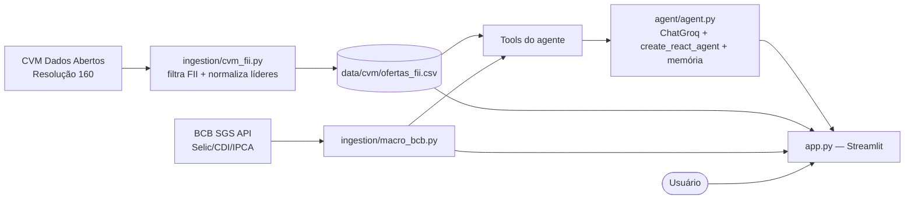

# Agente Inteligente de Análise de Ofertas Primárias de FII

Agente de IA que coleta, consolida e analisa **ofertas primárias de Fundos
Imobiliários (FII)** registradas na CVM, contextualizando-as com indicadores
macroeconômicos do Banco Central. Projeto desenvolvido no **Inteli Academy** em
parceria com o **Banco BTG Pactual**.

O sistema combina:
- **Coleta automatizada** de dados oficiais da CVM;
- Um **agente LangChain/LangGraph** que responde perguntas em linguagem natural
  consultando os dados reais (sem inventar números);
- Um **dashboard interativo** em Streamlit com filtros, gráficos e chat.

---

## Sumário

- [O problema](#o-problema)
- [Escopo](#escopo)
- [Arquitetura](#arquitetura)
- [Stack tecnológica](#stack-tecnológica)
- [Fontes de dados](#fontes-de-dados)
- [Como rodar](#como-rodar)
- [Estrutura do repositório](#estrutura-do-repositório)
- [As ferramentas do agente](#as-ferramentas-do-agente)
- [Exemplos de perguntas](#exemplos-de-perguntas)
- [Limitações conhecidas](#limitações-conhecidas)
- [Próximos passos](#próximos-passos)
- [Aprendizados](#aprendizados)

---

## O problema

Bancos e plataformas disponibilizam ofertas primárias diariamente, mas a análise
comparativa entre elas ainda é manual e fragmentada. Entender as diferenças de
volume, instituições líderes e como o cenário macroeconômico (juros, inflação)
influencia as emissões exige acompanhamento constante de várias fontes.

Este projeto transforma dados dispersos da CVM em **insights analíticos**,
permitindo explorar o mercado de FII de forma ágil e orientada por dados.

## Escopo

O escopo inicial é **exclusivamente Fundos Imobiliários (FII)** — incluindo
"Cotas de FII" e "Cotas de FIAGRO - FII". A base atual cobre **1.255 ofertas
registradas entre 2023 e 2026**, somando ~R$ 289 bilhões em volume.

> CRI (Certificados de Recebíveis Imobiliários) são **títulos de dívida**, não
> fundos, e por isso ficam fora do escopo, mesmo tendo "imobiliário" no nome.

## Arquitetura

O sistema tem três camadas: **coleta → inteligência → interface**.



1. **Coleta** — `cvm_fii.py` baixa o ZIP da CVM, filtra apenas FII e **normaliza
   as razões sociais** das instituições (ex.: as 3 entidades do BTG viram um
   único grupo "BTG Pactual"). `macro_bcb.py` busca indicadores do Banco Central.
2. **Inteligência** — o agente expõe os dados como *tools*. O LLM (Groq) decide
   qual ferramenta chamar e interpreta o resultado, num loop **ReAct**
   (Reasoning + Acting). Um *checkpointer* dá **memória de conversa**.
3. **Interface** — o Streamlit oferece duas abas: **Chat com o agente** e
   **Dashboard** com métricas, filtros e gráficos.

## Stack tecnológica

| Camada | Tecnologia |
|--------|------------|
| Orquestração do agente | LangChain · LangGraph (`create_react_agent`, `MemorySaver`) |
| LLM | ChatGroq — `llama-3.3-70b-versatile` (free tier) |
| Interface | Streamlit |
| Visualização | Plotly |
| Dados | pandas · requests |
| Linguagem | Python 3.11+ (testado em 3.14) |

## Fontes de dados

| Fonte | O que fornece | Acesso |
|-------|---------------|--------|
| **CVM — Dados Abertos** | Catálogo oficial de ofertas públicas (emissor, líder, volume, datas, status) | `oferta_distribuicao.zip` → `oferta_resolucao_160.csv` |
| **Banco Central — SGS** | Indicadores macro: Meta Selic (432), CDI (4389), IPCA (433) | API JSON pública |

> **Fonte avançada (não usada nesta versão):** o portal **SRE da CVM**
> (`web.cvm.gov.br/sre-publico-cvm`) funciona como uma API REST não documentada
> que expõe inclusive a **taxa final** de cada oferta (endpoint `infOferta`) e os
> PDFs dos prospectos. É o caminho natural de evolução para enriquecer os dados
> com taxas detalhadas. Ver [próximos passos](#próximos-passos).

## Como rodar

### Pré-requisitos
- Python 3.11 ou superior
- Uma chave de API da Groq (gratuita em <https://console.groq.com/keys>)

### 1. Ambiente virtual e dependências

```bash
python -m venv venv

# Windows (PowerShell)
venv\Scripts\activate
# Linux / macOS
source venv/bin/activate

pip install -r requirements.txt
```

### 2. Variável de ambiente

Copie `.env.example` para `.env` e cole sua chave:

```
GROQ_API_KEY=gsk_sua_chave_aqui
```

### 3. Coletar os dados da CVM

```bash
python src/ingestion/cvm_fii.py
```

Isso gera `data/cvm/ofertas_fii.csv` com as ofertas de FII filtradas e
normalizadas.

### 4. Rodar a aplicação

```bash
streamlit run src/app.py
```

Acesse <http://localhost:8501>. Use a aba **Chat** para conversar com o agente
ou a aba **Dashboard** para explorar os dados visualmente.

> Opcional — chat direto no terminal: `python src/agent/agent.py`

## Estrutura do repositório

```
BTGInteliAcademy/
├── README.md
├── requirements.txt
├── .env.example              # modelo de variáveis de ambiente
├── src/
│   ├── ingestion/
│   │   ├── cvm_fii.py        # coleta + filtro FII + normalização de líderes
│   │   └── macro_bcb.py      # indicadores macro do Banco Central
│   ├── agent/
│   │   └── agent.py          # agente ReAct + tools + memória (chat no terminal)
│   └── app.py                # aplicação Streamlit (Chat + Dashboard)
├── data/
│   └── cvm/ofertas_fii.csv   # gerado pela ingestão (não versionado)
└── contexto/                 # material de referência do projeto
```

## As ferramentas do agente

O agente decide sozinho qual usar com base na pergunta:

| Ferramenta | Para que serve |
|------------|----------------|
| `resumo_mercado_fii` | Visão geral: total de ofertas, volume por ano e principais líderes |
| `ranking_lideres_fii` | Ranking de instituições por volume (ex.: BTG vs XP) |
| `buscar_ofertas_fii` | Lista ofertas com filtros (emissor, líder, ano) e ordenação por data ou volume |
| `contexto_macro` | Selic, CDI e IPCA atuais para contextualizar o mercado |

## Exemplos de perguntas

- "Faça um resumo geral do mercado de FII."
- "Como o BTG Pactual se compara com a XP em 2025?"
- "Quais foram as 5 maiores ofertas de FII de 2025 por volume?"
- "Como a Selic atual se relaciona com o volume de emissões?"

Cada resposta no dashboard mostra um expander **"Ferramentas consultadas"**,
evidenciando de onde o agente tirou os números.

## Limitações conhecidas

- **Taxas detalhadas não disponíveis:** o CSV de Dados Abertos traz volume e
  estrutura, mas **não** a taxa final (IPCA+%, CDI+%) de cada oferta — essa
  informação está nos prospectos (PDFs) e exigiria a API SRE da CVM.
- **Free tier da Groq:** limites de 12 mil tokens/minuto e 100 mil tokens/dia.
  As ferramentas retornam texto compacto para caber nesse orçamento.
- **Escopo macro simplificado:** correlação com juros/inflação é interpretativa,
  não um modelo estatístico formal.
- **Sem notícias/eventos:** a contextualização ainda não cruza com notícias.

## Próximos passos

- Enriquecer os dados com a **API SRE da CVM** para obter taxa final e prospectos.
- Adicionar **memória vetorial (RAG)** para buscar "ofertas parecidas" no histórico.
- Incluir métricas de FII (P/VP, Dividend Yield) a partir dos prospectos.
- Camada de **notícias** para correlacionar emissões com eventos recentes.
- Evoluir para arquitetura **multi-agente** (coletor / analista / recomendador).

## Aprendizados

- **A docstring da tool é o prompt.** A qualidade do agente depende de descrever
  bem quando usar cada ferramenta — orientar "use X para totais, Y para listar"
  eliminou respostas erradas.
- **A tool precisa entregar o agregado pronto.** Quando uma ferramenta devolvia
  só uma amostra, o LLM tentava somar à mão e errava. A correção foi a própria
  tool calcular e retornar o total.
- **Normalização de entidades importa.** Sem consolidar as razões sociais, o BTG
  aparecia dividido e subestimado nas comparações.

---

*Projeto acadêmico — Inteli Academy × BTG Pactual.*
